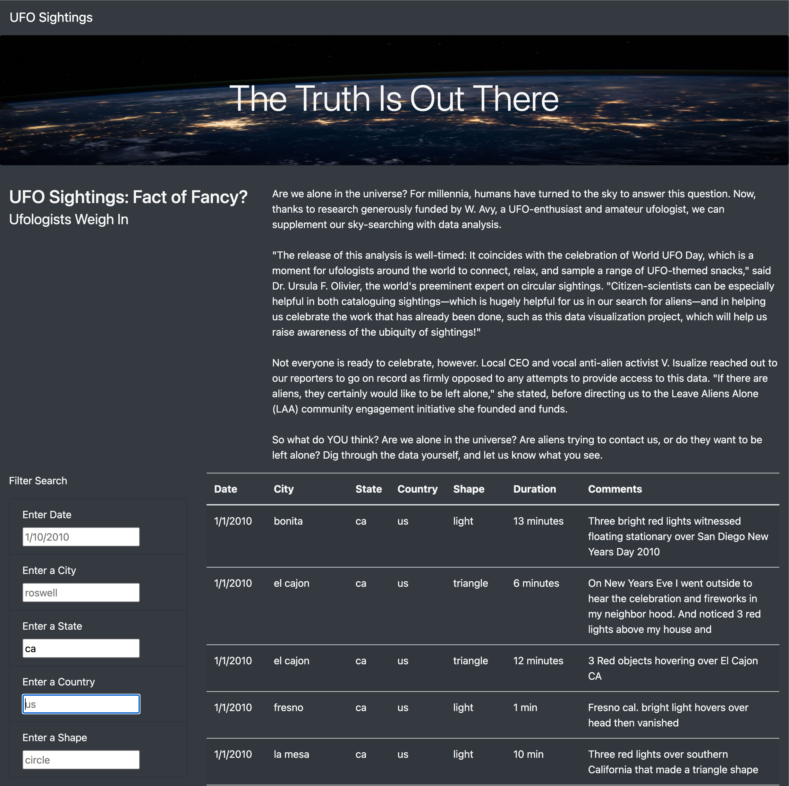
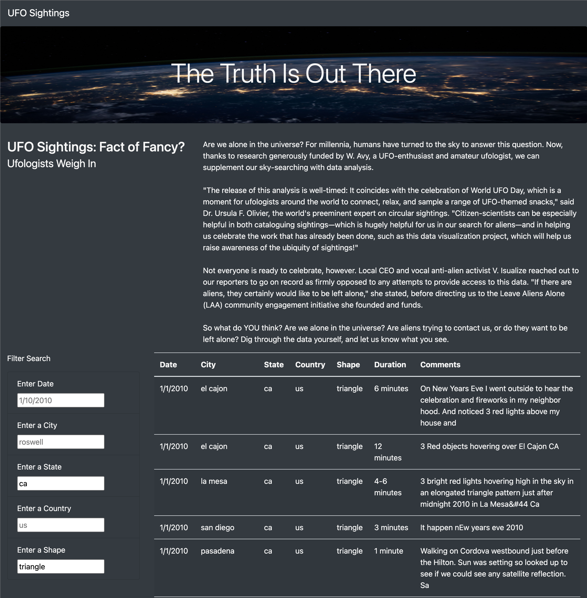

# UFOs

## Overview of Project

The analysis provided consists of creating a table to organize UFO data that is stored as a JavaScript array. This table will have the ability to filter data based on certain strings, using JavaScript as the primary coding language.

This tool will be used to assist users that are looking for UFO sightings information, allowing these users to filter data by date, state, city, state, country and UFO shape.

## Results

Dana, the final stage of the project is to make sure that you undestand how the filtering capabilities work and that you are fully comfortable working with the new feature on your own. I will explain how the fiters work below, dividing the process into steps.

1. First, take a look at the screenshot provided below. It shows the whole dataset with no filtering so far:

2. When you type a filter in any field, the table automagically (yes, just like magic!) gets updated with the data typed in the filter after I click outside the filter field or hit "tab". Let's type "ca" in the state field and see what data is returned:

3. Now here it comes the best part: you can use more than one filter at a time! That means, if you want to see UFO sightings in California AND shaped as a triangle, you can type "triangle" in the shape field and it will get updated.

Note that you can add filters in all the filter fields.

4. To restart the filtering process, you can refresh the page at any time.

## Summary

### New Design Drawback

Even thought the page is awesome, there is always room for improvement. One drawback in this new design is that we cannot add multiple filters on the same field, so if I need to see data from multiple states, for example, I would have to do two different filters, one for each state, one at a time.

### Recomendations of Improvement

Some future developments can dramatically change the experience in our page. Here are some recommendations of capabilities that can be added in the future:

1. Year Filter: Instead of searching only by an specific date, we could also filter data by year, as this will help users to search data in an specific year instead of a date.

2. Date Range Filter: filtering data by date range would also help to expand the feature to search for ranges instead of specific values.

3. New Data Input: we can also create a page to allow the user to input data, that can be added to the database after you verify its accuracy.

4. Multiple Filter Input: lastly, a feature of multiple data inputs in the same field could be developed, so the user could filter by multiple states, shapes, and countries,